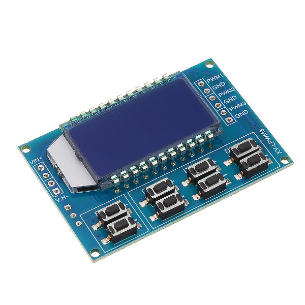

Simple Control-GUI for XY-LPWM PWM 3-Channel Signal Generator 
URL: https://github.com/ingo2012/pwm_control

I use this Board:

## pwm_control install

- sudo apt-get install python3-venv
- sudo apt update
- sudo apt upgrade 

- git clone https://github.com/ingo2012/pwm_control.git pwm_control
- cd pwm_control
- python3 -m venv venv

- source venv/bin/activate
- pip3 install -r requirements.txt

- python3 main.py

## Links
- Great Description of the one Channel Modul : [https://protosupplies.com/product/xy-lpwm-...](https://protosupplies.com/product/xy-lpwm-pwm-signal-generator-module/)
- AliExpress offer : [ XY-LPWM PWM 3-Channel](https://de.aliexpress.com/item/33011636435.html?src=google&albch=shopping&acnt=494-037-6276&isdl=y&slnk=&plac=&mtctp=&albbt=Gploogle_7_shopping&aff_atform=google&aff_short_key=UneMJZVf&&albagn=888888&albcp=1705854617&albag=67310370915&trgt=743612850714&crea=de33011636435&netw=u&device=c&albpg=743612850714&albpd=de33011636435&gclid=CjwKCAjw_Y_8BRBiEiwA5MCBJnjqtMOD8qASUXmFTYvDYd6SH5zvv4iPgxGwNUW-_Emty5KBV23KihoCurYQAvD_BwE&gclsrc=aw.ds)

