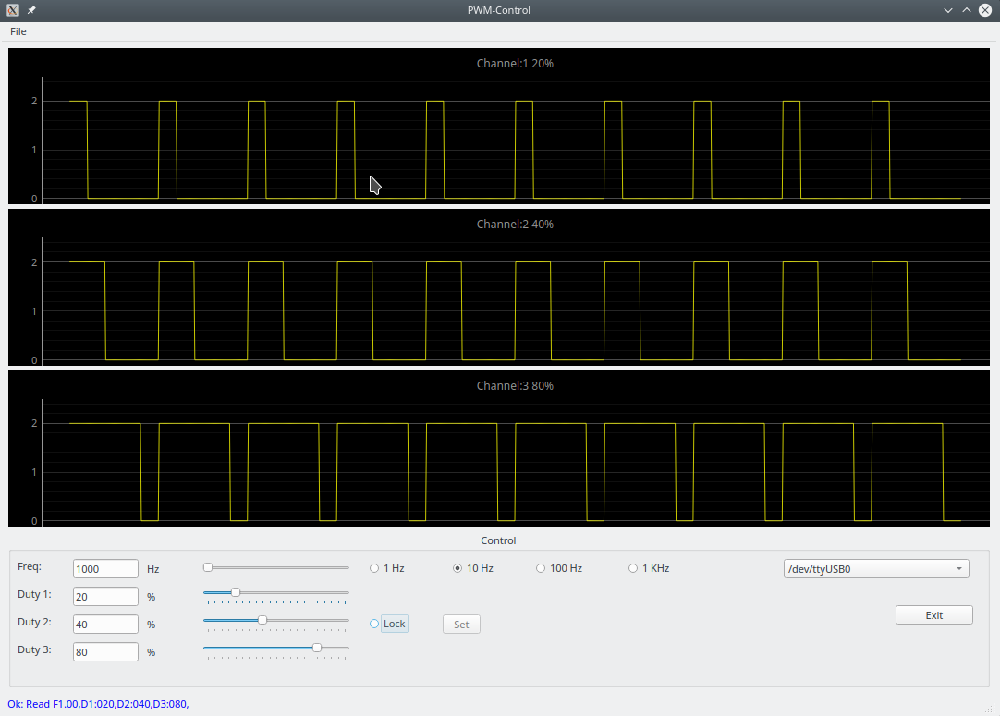

`pwm_control` 

# pwm_control

sudo apt-get install python3-venv
sudo apt update
sudo apt upgrade 

git clone https://github.com/ingo2012/pwm_control.git pwm_control
cd pwm_control
python3 -m venv venv

# activate VirtualEnv 
source venv/bin/activate
pip3 install -r requirements.txt

# Start 
python3 main.py

